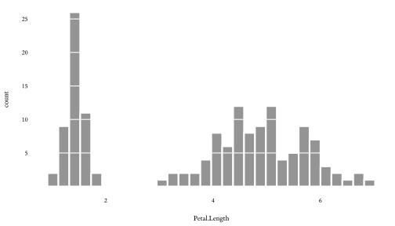
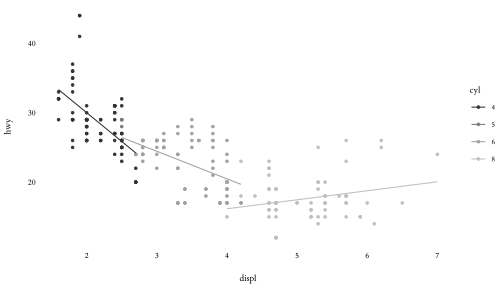

<!-- README.md is generated from README.Rmd. Please edit that file -->

# Emplot

<!-- badges: start -->

<!-- badges: end -->

A clean theme for `ggplot2` with matching `geom` defaults.

## Installation

Install from [GitHub](https://github.com/) using the
[devtools](https://cran.r-project.org/web/packages/devtools) package:

``` r
devtools::install_github("dbarrows/emplot")
```

Possible CRAN version in the future.

## Examples

``` r
library(ggplot2)
library(emplot)

ggplot(mpg, aes(displ, hwy, color = class)) +
    geom_point()
```


``` r
ggplot(mpg, aes(displ)) +
    geom_histogram(bins = 30)
```


## Options

The grid can be forced on/off with the `grid` option:

``` r
ggplot(iris, aes(Sepal.Length, Sepal.Width, color = Species)) +
    geom_point() +
    geom_smooth(method = lm, alpha = 0.25) +
    theme_emplot(grid = FALSE)
```


The font can be changed to a serif with the `serif` option (for the
[Tufte](https://www.edwardtufte.com/tufte/) look):

``` r
ggplot(iris, aes(Petal.Length)) +
    geom_histogram(bins = 30) +
    scale_y_continuous(breaks = seq(5, 25, by = 5)) +
    geom_hline(yintercept = seq(5, 25, by = 5), col = "white") +
    theme_emplot(grid = FALSE, serif = TRUE)
```



``` r
library(tidyverse)
mpg %>%
    mutate(cyl = as.factor(cyl)) %>%
    ggplot(aes(displ, hwy, color = cyl)) +
        geom_point(size = 1.25) +
        geom_smooth(method = lm, se = FALSE, size = 0.5) +
        theme_emplot(grid = FALSE, serif = TRUE) +
        scale_color_grey(end = 0.75)
```


