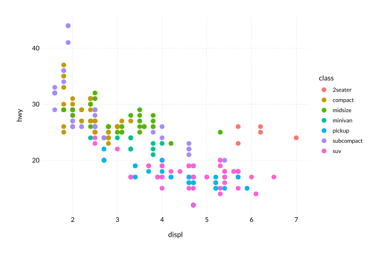
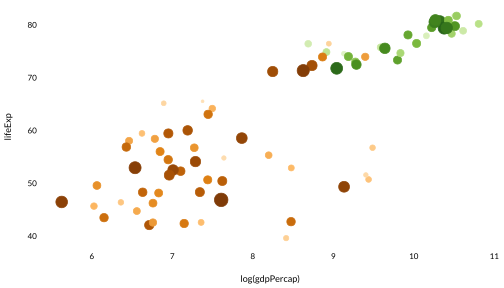
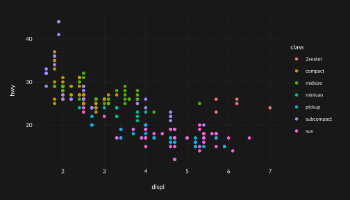
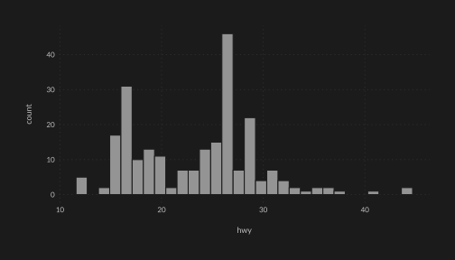
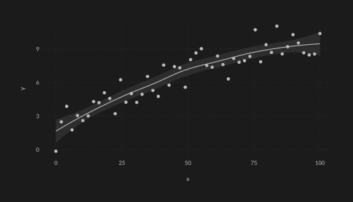
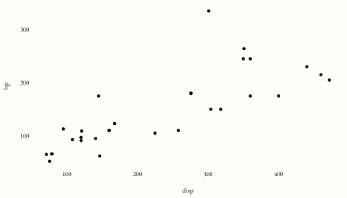
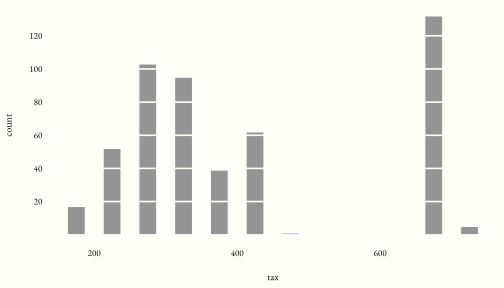

<!-- README.md is generated from README.Rmd. Please edit that file -->

# wplot

<!-- badges: start -->

[](https://github.com/dbarrows/wplot/actions)
[](https://www.tidyverse.org/lifecycle/#experimental)
<!-- badges: end -->

A clean theme for `ggplot2` with matching `geom` defaults.

## Installation

Install from [GitHub](https://github.com/) using the
[devtools](https://cran.r-project.org/web/packages/devtools) package:

``` r
devtools::install_github("dbarrows/wplot")
```

Possible CRAN version in the future.

## Examples

### Light Theme

``` r
library(ggplot2)
library(wplot)

theme_set(theme_wl())
```

``` r
ggplot(mpg, aes(displ, hwy, colour = class)) +
    geom_point()
```



``` r
ggplot(mpg, aes(displ)) +
    geom_histogram(bins = 30)
```


### Options

The grid can be turned on/off with the `grid` option, and the font can
be a made `serif`:

``` r
library(tidyverse)
library(gapminder)

gapminder %>%
    mutate(cc = I(country_colors[match(country, names(country_colors))])) %>%
    filter(continent %in% c("Africa", "Europe") & year == 2007) %>%
    ggplot(aes(log(gdpPercap), lifeExp)) +
        geom_point(aes(colour = cc, size = sqrt(pop/pi)/1500)) +
        theme_wl(grid = FALSE, serif = TRUE) +
        theme(legend.position = "none")
```



### Dark theme

``` r
library(colorblindr)

ggplot(mpg, aes(displ, hwy, colour = class)) +
    geom_point() +
    theme_wd() +
    scale_colour_OkabeIto() +
    theme(plot.margin = margin(1, 1, 1, 1, "cm"))
```



``` r
iris %>%
    ggplot(aes(Sepal.Width)) +
        geom_histogram() +
        theme_wd() +
        theme(plot.margin = margin(1, 1, 1, 1, "cm"))
```



``` r
tibble(x = seq(0, 100, length.out = 50),
       y = sqrt(x) + rnorm(length(x))) %>%
    ggplot(aes(x, y)) +
        geom_point() + 
        geom_smooth() +
        theme_wd() +
        theme(plot.margin = margin(1, 1, 1, 1, "cm"))
```



### Classic theme

For a slightly larger serif font, smaller points, and no grid.

``` r
mpg %>%
    ggplot(aes(displ, cty)) +
    geom_point() +
    geom_smooth() +
    theme_wc()
```


### Tufte theme

You can get the [Tufte](https://www.edwardtufte.com/tufte/) look:

``` r
library(MASS)

Boston %>%
    ggplot(aes(ptratio, tax)) +
        geom_point() +
        geom_rug() +
        theme_wt()
```



``` r
h <- Boston %>%
    pull(tax) %>%
    hist(plot = FALSE)
df <- h %>%
    with(tibble(tax = mids, count = counts))
ybreaks <- seq(20, max(df$count), by = 20)
df %>%
    ggplot(aes(tax, count)) +
        geom_col(orientation = "x", width = diff(h$breaks[1:2])/2) +
        scale_y_continuous(breaks = ybreaks) +
        theme_wt() +
        geom_hline(size = 0.75,
                   yintercept = ybreaks,
                   col = theme_wt()$plot.background$fill)
```


